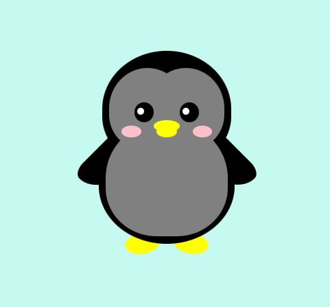

# Proyecto Pingüino en HTML y CSS

Este proyecto consiste en la creación de una representación de un pingüino utilizando HTML y CSS. El objetivo principal es practicar y demostrar habilidades en la creación de diseños web utilizando solo elementos `div` y estilos CSS.

## Vista previa



## Tecnologías utilizadas

- HTML
- CSS

## Instrucciones de uso

1. Clona este repositorio en tu computadora:

   ```bash
   git clone https://github.com/JoseF7830/pinguino-html-css.git


Puedes ver el proyecto en este sitio: https://josef7830.github.io/pinguino-html-css/
